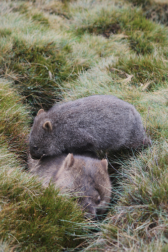
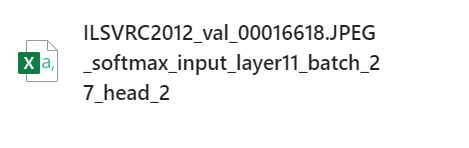

# Pytorch ViT int8 Data Dump

This repository provides a script to retrieve input and output data of functions such as softmax, gelu, and layernorm during the testing process of the ViT int8 based on PyTorch. The data is then saved into CSV files, allowing for further analysis of the computational characteristics of these functions during the execution of ViT int8.

## Usage

- Switch to the working directory by following the instructions.
    ```bash
    cd examples/pytorch/vit/ViT-quantization
    ``` 

- Before obtaining specific experimental data, you need to make some preparations (refer to the guidance for ViT Quantization Toolkit).
  - 1. According to the official guidance of FasterTransformer, configure a Docker environment suitable for your GPU.
  - 2. Download Pre-trained model (Google's Official Checkpoint)：
      *In the experiment, we used the imagenet21k pre-train models 'ViT-B_16.npz'. Please download it and place it in the examples/pytorch/vit/ViT-quantization directory.
  - 3. Data preparation (We placed the data in the directory "examples/pytorch/vit/ViT-quantization/data"):
      *We use standard ImageNet dataset, you can download it from http://image-net.org/:
      *For standard folder dataset, move validation images to labeled sub-folders. The file structure should look like:
  ```bash
  $ tree data
  imagenet
  ├── train
  │   ├── class1
  │   │   ├── img1.jpeg
  │   │   ├── img2.jpeg
  │   │   └── ...
  │   ├── class2
  │   │   ├── img3.jpeg
  │   │   └── ...
  │   └── ...
  └── val
      ├── class1
      │   ├── img4.jpeg
      │   ├── img5.jpeg
      │   └── ...
      ├── class2
      │   ├── img6.jpeg
      │   └── ...
      └── ...
  ```
    - 4. Calibration:
      *You can start the Calibration process by following the command below, which will generate a corresponding ViT-B_16_calib.pth file to prepare for the next step of Evaluation.
  ```bash
  sh examples/pytorch/vit/ViT-quantization/run_calib.sh
  ```
    -5. Evaluation：
      *Validation data preparation: You can choose specific images you want to validate and place them in the "val" folder following the format of the dataset mentioned above. Replace the entire original validation dataset with these selected images.
      *Choose the function：In the "examples/pytorch/vit/infer_visiontransformer_int8_op.py" file, locate the following code, and based on the function you want to export, choose the modules to import. We have provided data export configurations for softmax, gelu, and layernorm.
  ```bash
  # Change this parameter while the program is running
    version = "gelu"   # or "softmax" , "layernorm_1" , "layernorm_2"  
  # Load the corresponding module according to version
    VisionTransformerINT8 = load_module(f'vit_int8_{version}')
  ```
  *Then you can start the Evaluation process by following the command:
```bash
cd examples/pytorch/vit
sh run_test.sh
```

## Examples

- After the evaluation process, you can export the relevant data for the corresponding validation images. Below is an example.




